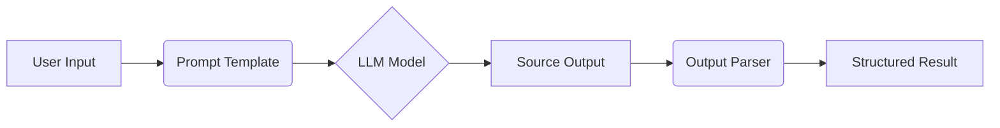

## 一、LangChain 简介

**LangChain** 是一个用于构建大语言模型（LLM）应用的开发框架。它通过模块化设计简化了 LLM 应用的开发流程，核心功能包括：

- **组件化架构**：提供可复用的模块（如提示模板、模型接口、输出解析器）
- **链式编排**：将多个组件连接成工作流（Chain）
- **上下文管理**：支持外部数据源（文档、数据库）与 LLM 集成
- **代理系统**：让 LLM 动态调用工具（搜索、计算等）

适用场景：聊天机器人、文档问答、自动编程助手等。

------

## 二、基本示例代码

```python
from langchain.prompts import PromptTemplate
from langchain_openai import ChatOpenAI
from langchain_core.output_parsers import StrOutputParser

# 1. 定义提示模板
prompt = PromptTemplate.from_template(
    "用一句话解释 {concept} 的技术原理"
)

# 2. 初始化模型
model = ChatOpenAI(
    model="google/gemma-3-1b",
    base_url="http://192.168.1.37:1234/v1",
    api_key="lmstudio",
)

# 3. 输出解析器
output_parser = StrOutputParser()

# 构建处理链
chain = prompt | model | output_parser

# 执行链
response = chain.invoke({"concept": "区块链"})
print(response)
```

**输出示例**：
`区块链通过分布式账本和加密技术，将交易数据按时间顺序连接成不可篡改的链式结构。`

------

## 三、核心组件详解

### 1. Prompt（提示模板）

**作用**：动态生成给模型的指令，确保输入标准化
**关键特性**：

- 支持变量插值（如 `{concept}`）
- 包含示例（few-shot learning）
- 可集成外部数据

```python
# 带示例的提示模板
prompt = PromptTemplate(
    template="示例：{example}\n问题：{query}",
    input_variables=["example", "query"]
)
```

### 2. Model（模型接口）

**作用**：统一调用不同 LLM 的抽象层
**支持模型类型**：

- 聊天模型（`ChatOpenAI`, `ChatAnthropic`）
- 文本生成模型（`OpenAI`, `HuggingFaceHub`）
- 嵌入模型（`OpenAIEmbeddings`）

```python
from langchain_community.llms import HuggingFaceHub

# 切换为 HuggingFace 模型
model = HuggingFaceHub(repo_id="google/flan-t5-xxl")
```

### 3. Output Parser（输出解析器）

**作用**：将模型原始输出转换为结构化数据
**常用解析器**：

| 类型                             | 功能                 | 代码示例                                |
| :------------------------------- | :------------------- | :-------------------------------------- |
| `StrOutputParser`                | 提取纯文本           | `result = parser.parse("...")`          |
| `JSONOutputParser`               | 解析 JSON 对象       | `parser = JsonOutputParser()`           |
| `CommaSeparatedListOutputParser` | 分割逗号字符串为列表 | `parser.parse("A,B,C") → ['A','B','C']` |

```python
from langchain_core.output_parsers import JsonOutputParser

# 解析 JSON 输出
parser = JsonOutputParser()
response = '{"name": "Alice", "age": 30}'
parsed = parser.parse(response)  # → {'name': 'Alice', 'age': 30}
```

------

## 四、组件协作流程图



**关键优势**：

1. **解耦设计**：可单独替换组件（如更换模型无需改提示）
2. **错误隔离**：解析失败不会导致整个链崩溃
3. **标准化输出**：确保下游系统接收统一格式

> 提示：使用 `langchain.debug = True` 可查看链式调用的详细过程